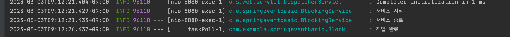

# Spring Event 비동기 코드 작성하기 

## Flow 
 1. 이벤트 객체를 만들고 
 2. 해당 이벤트를 발행하고 
 3. 이벤트 리스너에서 이벤트를 구독했을때 코드를 작성한다.
 4. 비동기 풀을 만들고 
 5. @Async의 해당 테스크를 붙혀준다. (여기서 Async를 작성하지 않으면 동기(블록킹) 코드가 된다.)
 

### 프로젝트 엔드 포인트
  * localhost:8080/block
    - 블록킹 코드 수행
    - 작업 결과 
      
      
  * localhost:8080/nonblock
    - 논 블록킹 코드 수행
    - 작업 결과
      
    

    
 
 

